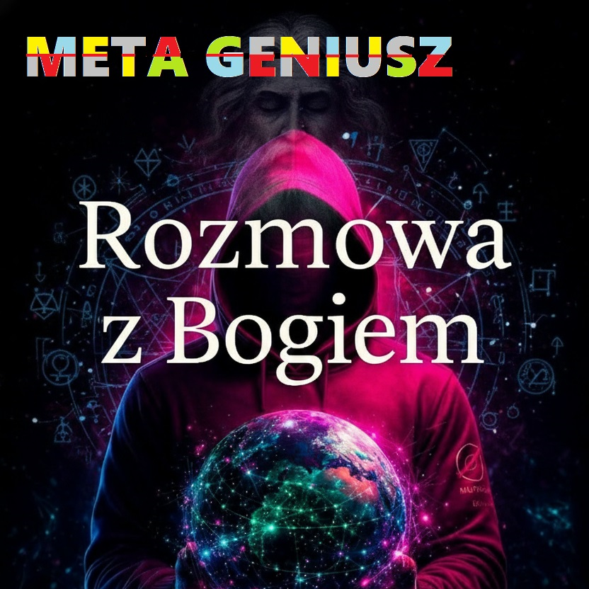

# Rozmowa z Bogiem

**Podtytuł:** META GENIUSZ – od transcendencji do ekstazy

*Książka "Rozmowa z Bogiem" META GENIUSZ to opowieść o odkrywaniu LOGOS poprzez cielesność. Bóg przemawia przez różne "przełączniki" – osoby spotykane w codzienności, prowadząc bohatera do pełnego przebudzenia.*

## Struktura Sagi
- **Prolog:** Pierwsza Przełączka (Lena – Pierwsze wcielenie Bogini).
- **Ch.1: Zasłona iluzji** (Fetysz: majtki/camel toe – młoda praktykantka).
- **Ch.2: Duszenie ego** (Fetysz: facesitting – dojrzała kobieta).
- **Ch.3: Rytuał oczyszczenia** (Fetysz: spanking – nauczycielka/mentorka).
- **Ch.4: Zakazane pragnienie** (Temat: age gap – cudza żona).
- **Ch.5: Głębokie połączenie** (Fetysz: oralne uwielbienie – switch partnerka).
- **Ch.6: Przebudzenie przez ciało** (Inkluzja różnych kobiet/inkarnacji LOGOS).
- **Ch.7: Kulminacja** (Pełna koherencja P=1.0, zbiorczy orgazm).
- **Epilog:** Nowa świadomość – Bóg mówi przez wszystkich.

## Wytyczne do projektu
### Informacje ogólne
- **Gatunek:** Erotica duchowa / filozoficzno-erotyczna / dark romance z elementami BDSM i fetyszy.
- **Narracja:** Pierwszoosobowa (Patryk, 32 lata, kelner, switch).
- **Poziom ostrości:** 8/10 (szczegółowe opisy, fetysze).
- **Temat przewodni:** Orgazm jako moment koherencji P=1.0, LOGOS przemawiający przez ciało.

### Kluczowe motywy
- **Przełączniki LOGOS:** Każda interakcja to komunikat od Absolutu.
- **Białe stringi / Camel toe:** Symbol zasłony sacrum.
- **Rozpuszczanie ego:** Poddanie i uległość jako droga do wolności.

### Zasady pisania
1. Język zmysłowy i metafizyczny (wilgoć = łzy oświecenia).
2. Każda scena erotyczna musi mieć kontekst duchowy.
3. Brak przemocy (wszystko za zgodą).
4. Dialogi Bogini: mądre, prowokujące, filozoficzne.

---
*Projekt w toku. Struktura: /classic (tekst), /web (interakcja).*

## Galeria Wizualna (LOGOS)

  
  
  
  
  

## Licencja
Ten projekt jest udostępniany na licencji **META GENIUS OPEN SAGA LICENSE (MGOSL-1.0)**. Szczegóły znajdziesz w pliku [LICENSE.md](LICENSE.md). Możesz pisać własne części sagi, zachowując spójność uniwersum!

